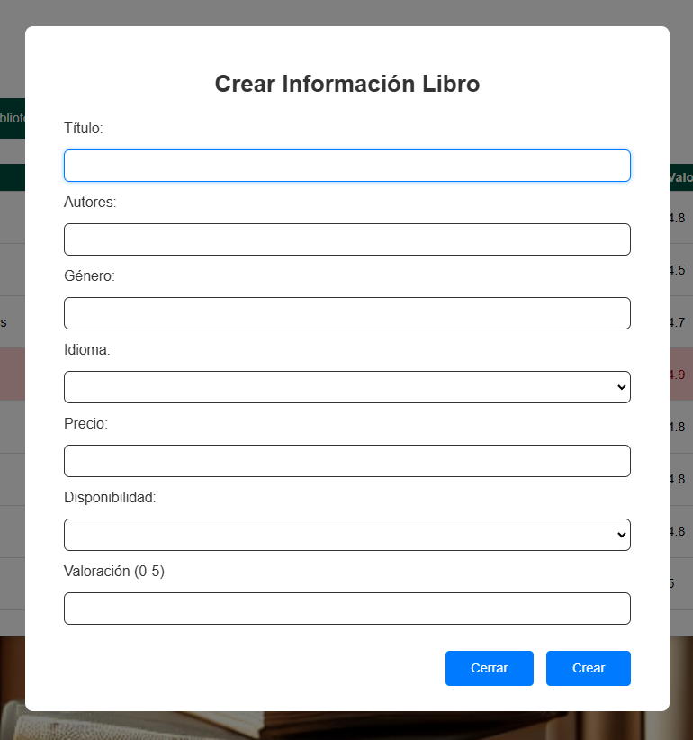

#  📚 Book Manager API
This project is built with Node.js and Express to manage a book collection stored in JSON format through CRUD operations.

### 🎯 Features
- Allows users to create, read, update, and delete book information (CRUD).
- The data is dynamically stored in a JSON file inside the data/ folder.
- Each book includes the following information:
  - Title, Author, Genre, Language, Price, Availability, and Rating.
- Includes buttons to edit or delete books from the interface.
  
### 🚀 Technologies Used
- **Node.js**: Runtime environment used to build the backend.
- **Express.js**: A Node.js framework for handling routes and middleware.
- **JSON**: Used as a database to store and update book information.
- **HTML5**: Structure for the user interface.
- **CSS3**: Visual styling.
- **JavaScript**: Handles logic and user interactions.

### 🛠️ CRUD Route
| Method   | Endpoint            | Description                         | Example Usage                                      |
|----------|---------------------|-------------------------------------|--------------------------------------------------|
| **GET**      | `/libros`           | Retrieves all books                 | -                                                |
| **GET**      | `/libros/:id`       | Retrieves a specific book by its ID | `/libros/1`                                      |
| **POST**     | `/libros`           | Creates a new book                  | `{"title": "1984", "author": "George Orwell"}`   |
| **PUT**      | `/libros/:id`       | Updates an existing book by its ID  | `/libros/1` with body `{"title": "New Title"}`   |
| **DELETE**   | `/libros/:id`       | Deletes a book by its ID            | `/libros/1`                                      |

### 🟰 User's interface




---
### ⚙️ Instalation
1. Clone this repository:
   ```
   git clone https://github.com/DonLuisM/BookManager.git
   cd BookManager
   ```
2. Install dependencies
   ```
   npm install
   ```
3. Start the server
   ```
   npm run dev
   ```
   

